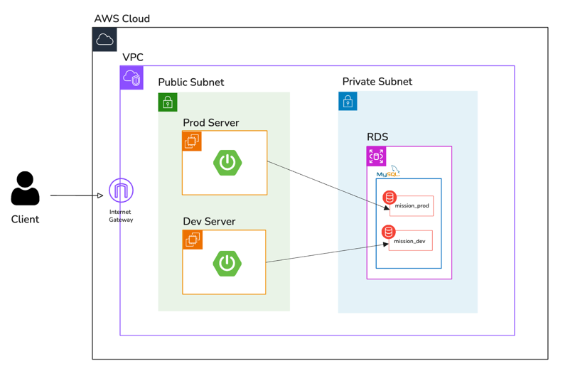

## **필수 요구사항**

### **1. 애플리케이션을 AWS에 배포 가능한 상태로 구축해야 한다**

- **EC2 인스턴스 생성:** `dev`와 `prod` 환경을 위한 애플리케이션 서버(`t3.small`)를 각각 생성했습니다.
- **서버 환경 구성:** Ubuntu OS에 Git, Java 21 등 애플리케이션 실행에 필요한 도구를 모두 설치했습니다.
- **애플리케이션 빌드 및 실행:** GitHub에서 소스 코드를 받아 Gradle로 빌드하고, `nohup`과 `java -jar` 명령어를 통해 백그라운드에서 애플리케이션을 성공적으로 실행했습니다.
- **자동 배포 스크립트:** `deploy.sh` 스크립트를 작성하여 Git `pull`부터 빌드, 재시작까지의 과정을 자동화했습니다.
    - deploy.sh

        ```bash
        #!/bin/bash
        
        # 1. 변수 설정
        PROJECT_PATH="/home/ubuntu/lv3-final-mission"
        JAR_NAME=$(ls $PROJECT_PATH/build/libs/ | grep 'SNAPSHOT.jar' | tail -n 1)
        JAR_PATH=$PROJECT_PATH/build/libs/$JAR_NAME
        PROFILE="dev"
        TARGET_PORT=80
        
        # 2. 현재 실행 중인 애플리케이션 PID 찾기 및 종료
        CURRENT_PID=$(lsof -t -i:${TARGET_PORT})
        
        if [ -z $CURRENT_PID ]; then
          echo "> 현재 실행 중인 애플리케이션이 없습니다."
        else
          echo "> 현재 실행 중인 애플리케이션을 종료합니다. (PID: $CURRENT_PID)"
          kill -15 $CURRENT_PID
          sleep 5
        fi
        
        # 3. 프로젝트 최신 버전 받기
        echo "> 프로젝트를 pull 받습니다."
        cd $PROJECT_PATH
        git checkout yuyoungrhee
        git fetch --all
        git reset --hard origin/yuyoungrhee
        git pull origin yuyoungrhee
        
        # 4. 프로젝트 빌드
        echo "> 프로젝트를 빌드합니다."
        chmod +x ./gradlew
        ./gradlew clean build
        
        # 5. 새 애플리케이션 배포
        echo "> 새 애플리케이션을 배포합니다."
        # 80번 포트는 sudo 권한 필요
        sudo nohup java -jar -Dspring.profiles.active=$PROFILE -Dserver.port=$TARGET_PORT $JAR_PATH > /home/ubuntu/app.log 2>&1 &
        
        # 6. 헬스 체크
        echo "> 헬스 체크를 시작합니다."
        sleep 10 # 애플리케이션이 실행될 시간을 기다림
        
        for retry_count in {1..10}
        do
          RESPONSE=$(curl -s http://localhost:${TARGET_PORT}/actuator/health)
          UP_COUNT=$(echo $RESPONSE | grep 'UP' | wc -l)
        
          if [ $UP_COUNT -ge 1 ]; then
            echo "> 헬스 체크 성공. (시도 횟수: ${retry_count})"
            break
          else
            echo "> 헬스 체크 실패 또는 응답 없음. (시도 횟수: ${retry_count})"
          fi
        
          if [ $retry_count -eq 10 ]; then
            echo "> 헬스 체크 실패. 배포를 중단합니다."
            # 배포 실패 시 현재 실행중인 프로세스 다시 종료
            NEW_PID=$(lsof -t -i:${TARGET_PORT})
            if [ ! -z "$NEW_PID" ]; then
                kill -15 $NEW_PID
            fi
            exit 1
          fi
          sleep 10
        done
        
        echo "> 배포가 성공적으로 완료되었습니다."
        exit 0
        ```


### **2. 애플리케이션 서버와 데이터베이스 서버를 물리·네트워크 계층에서 분리해야 한다.**

- **VPC 및 서브넷 구성:** 미션을 위한 별도의 VPC를 생성하고, 외부와 통신하는 **Public Subnet**과 내부망에만 존재하는 **Private Subnet**으로 네트워크 환경을 분리했습니다.
- **리소스 배치:**
    - *애플리케이션 서버(EC2)**는 **Public Subnet**에 배치하여 외부 요청을 받을 수 있도록 했습니다.
    - *데이터베이스 서버(RDS)**는 **Private Subnet**에 배치하여 외부로부터의 직접적인 접근을 원천 차단했습니다.
- **보안 그룹을 통한 접근 제어:** RDS의 보안 그룹(방화벽)에 EC2 보안 그룹으로부터의 접속만 허용하는 규칙(Inbound Rule)을 추가하여, 오직 우리의 애플리케이션 서버만이 DB에 접근할 수 있도록 네트워크 보안을 강화했습니다.

### **3. 개발(dev)과 운영(prod)의 설정을 서로 독립적으로 관리·배포해야 한다.**

- **물리적 서버 분리:** 애플리케이션을 위해 `mission-app-dev`와 `mission-app-prod`라는 2개의 독립된 EC2 인스턴스를 구축하여, 각 환경의 배포가 서로에게 영향을 주지 않도록 했습니다.
- **논리적 데이터베이스 분리:** 하나의 RDS 인스턴스 내에 `mission_dev`와 `mission_prod`라는 별개의 데이터베이스(스키마)를 생성하여 데이터가 섞이지 않도록 분리했습니다.
- **설정 파일 분리:** `application-dev.yml`과 `application-prod.yml` 파일을 각각 작성하여 사용하는 데이터베이스의 정보(`url`)나 `ddl-auto` 정책 등을 환경별로 다르게 관리했습니다.
- **환경별 실행:** 애플리케이션 실행 시 `Dspring.profiles.active` 옵션을 사용하여 `dev`와 `prod` 환경에 맞는 설정 파일을 선택적으로 로드하도록 구성했습니다.

### 추가 요구사항
인프라 아키텍처

